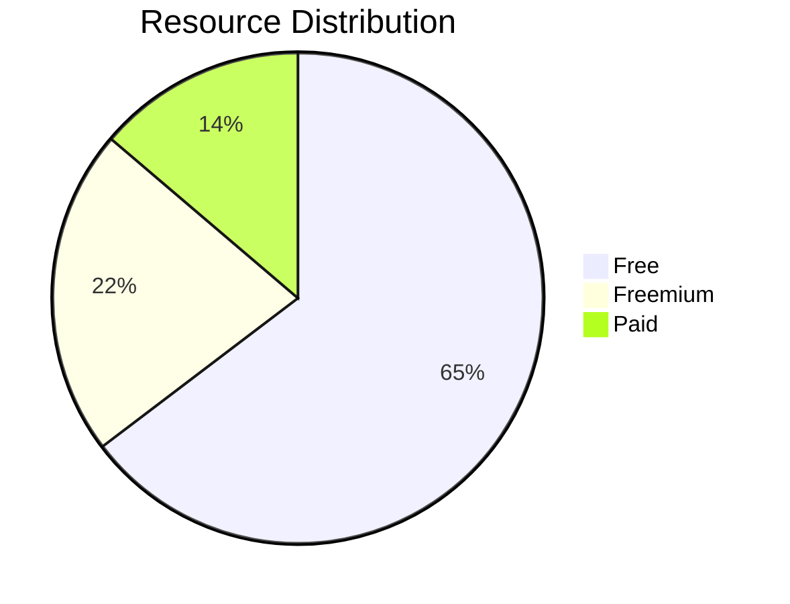

> Curated computer science resources, coding challenge, and online learning platforms for software developers.

## Statistics

## Categories

- **[💻 Interactive Coding Platforms](/resources/interactive/)** - 112 resources
- **[📚 Online Learning Platforms](/resources/courses/)** - 32 resources
- **[🗣️ Interview Preparation](/resources/interview/)** - 36 resources
- **[🐧 Linux & DevOps Labs](/resources/devops/)** - 42 resources
- **[🌐 Networking](/resources/network/)** - 18 resources
- **[🛡️ Cybersecurity Labs](/resources/security/)** - 38 resources
- **[🎮 Game-Based Learning](/resources/games/)** - 24 resources
- **[🏛️ University & Academic](/resources/university/)** - 17 resources
- **[🛠️ Project-Based Practice](/resources/practice-projects/)** - 15 resources

---

## 🏷️ Categories Legend

| Badge                                    | Meaning                                 |
| ---------------------------------------- | --------------------------------------- |
| <Badge type="tip" text="Free" />         | Fully accessible without payment        |
| <Badge type="warning" text="Freemium" /> | Limited free content with paid upgrades |
| <Badge type="danger" text="Paid" />      | Requires subscription or purchase       |

---

## 🤝 Contributing

Found a great resource? Contributions are welcome!

1. Fork the repository
2. Add your resource to `data/resources.json`
3. Run `bun run generate` to regenerate pages
4. Submit a pull request
